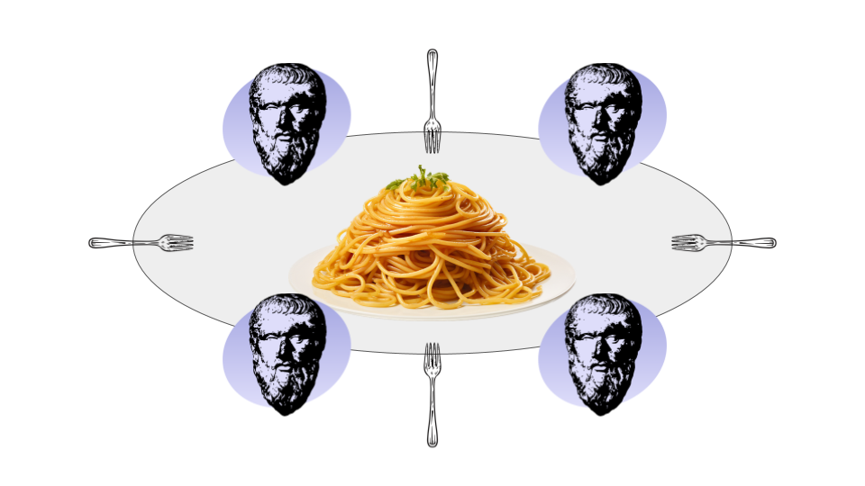

# [Philosophers | 42 School - Rank 03]

## Overview
The Philosophers project illustrates a classical problem in **concurrent programming**. The problem revolves around **multiple philosophers** `(threads)` seated around a table, each requiring **two forks** `(mutex)` to eat from a central bowl of spaghetti.

<div align="center">
  
</div>

## Problem Description
- **Number of Philosophers**: Matches the number of forks.
- **Activities**: Philosophers can either **eat**, **think**, or **sleep**.
- **Eating**: Requires **two forks** (right and left).
- **Sequence**: When a philosopher finishes eating, they sleep, and upon waking up, they start thinking. The cycle continues until a philosopher starves, ending the simulation.
- **Communication**: Philosophers **do not communicate**; they act based on the **availability of resources** (forks).

## How to Use
1. **Clone the repository:**
`git clone https://github.com/lgandarillas/philosophers.git`
`cd philosophers`

2. **Compile the project:**
`make`

3. **Run the simulation:**
You can run the project by providing the required parameters:
`./philo number_of_philosophers time_to_die time_to_eat time_to_sleep [number_of_times_each_philosopher_must_eat]`

To run the simulation effectively, it's important to configure the parameters according to the number of philosophers to prevent them from starving. The parameters depend on whether the number of philosophers is even or odd, as follows:

- For an **even number of philosophers**
The `time_to_die` should be set to **double** the `time_to_eat` plus a small margin to account for timing discrepancies. This setting helps ensure that philosophers can complete their eating cycles without dying prematurely due to timing issues in thread scheduling.
**Example:** For 2 philosophers:
```bash
./philo 2 410 200 200
```

- For an **odd number of philosophers**
The `time_to_die` should be **triple** the `time_to_eat` plus a small margin. This configuration is necessary because, with an odd number of philosophers, the resource contention is slightly more complex, increasing the likelihood of a philosopher not getting enough time to eat.
**Example:** For 3 philosophers:
```bash
./philo 3 310 100 100
```

- Additional Examples
```bash
./philo 5 610 200 200
./philo 4 810 400 200
```

## Makefile Targets
The Makefile includes the following targets for building the project:
- `make`: Compiles the **main program**.
- `make mem`: Compiles with **AddressSanitizer** to check for memory leaks.
- `make thread`: Compiles with **ThreadSanitizer** to check for race conditions.

To ensure **ThreadSanitizer** runs correctly on Ubuntu systems, execute:
```bash
sudo sysctl vm.mmap_rnd_bits=28
```
This setting adjusts the memory randomization level which can interfere with ThreadSanitizer.

## Learnings
Developing this project helped in understanding:
- The challenges of **concurrent programming** and **resource management**.
- The practical application of **threads** and **mutexes** in managing access to shared resources.
- How to design a solution that effectively **prevents data races and deadlocks**.

This implementation utilizes **POSIX threads (pthreads)** to simulate each **philosopher** and **mutexes** to manage resource **(forks)** allocation to prevent race conditions. Key functions used include:
- `pthread_create`
- `pthread_detach`
- `pthread_join`
- `pthread_mutex_init`
- `pthread_mutex_lock`
- `pthread_mutex_unlock`

Each philosopher is implemented as a **separate thread**, and a **mutex** represents **each fork** to ensure that no two philosophers can hold the same fork simultaneously.

## Resources
For a deeper understanding of a simulation, visit this helpful page:
- [Philosophers Visualizer](https://nafuka11.github.io/philosophers-visualizer/)
